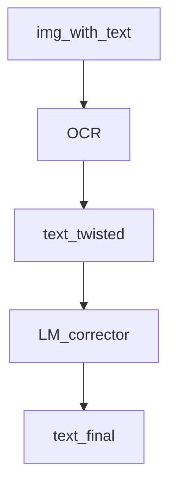

# ocr_enhancement
An assignment for NLP.

## 任务分工

实验任务定义：OCR +LM

子任务

1. OCR （= 网页demo）：廖兴滨、陈克正
2. LM：苗栋
3. 形似纠错：蔡秀定、钱杨舸

文档演示

1. 人员
2. PPT


## 任务进度

##### OCR （= 网页demo）

- [ ] OCR 模型
- [ ] 能与纠错模型交互（its output as input）

##### LM

- [ ] 模型选择
- [ ] 剪枝
- [ ] 困惑度计算接口

##### 形似纠错

- [ ] shape2vec
- [ ] 形近字字典
- [ ] 用于训练纠错模型的语料
- [ ] 神经网络纠错模型
- [ ] 动态规划纠错模型


## 实验思路

大致流程，两阶段方法（two-stage）



缺点

1. OCR 和使用形近字字典生成的用于纠错的语料分布不一致


## 一、OCR

### What’s needed?

You must install Tesseract-OCR first and add the path/to/your/Tesseract-OCR to the end of your computer's system path, and then install pytesseract and pillow using pip.

```shell
pip install Pillow
pip install pytesseract
```

Other OCR tools(supported by pyocr) can work as well.


## 二、Language Model


## 三、Corrector